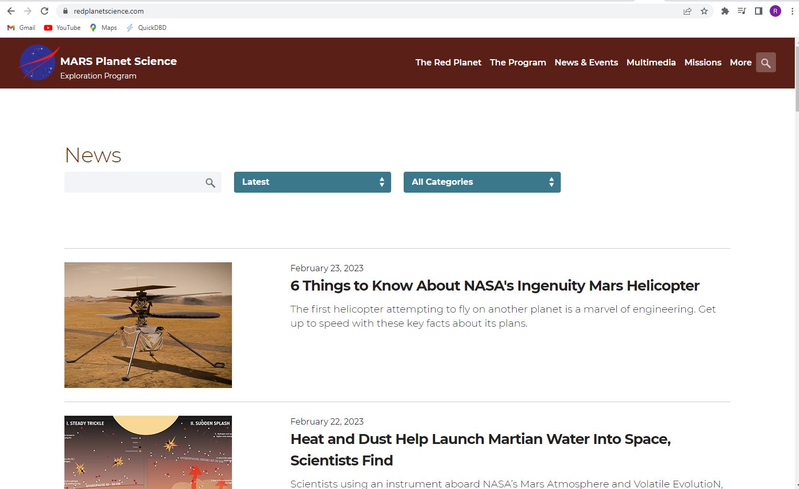
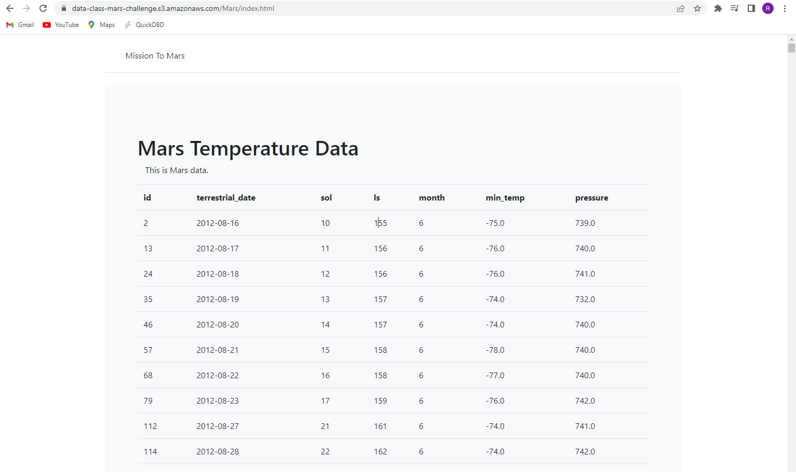
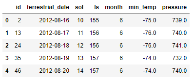
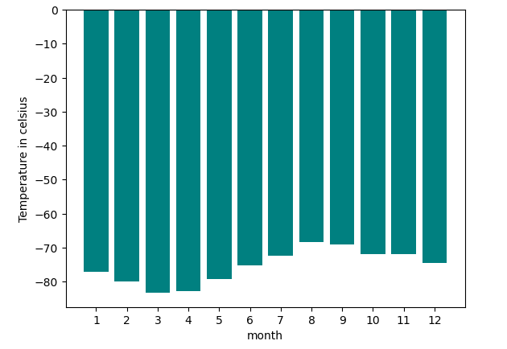
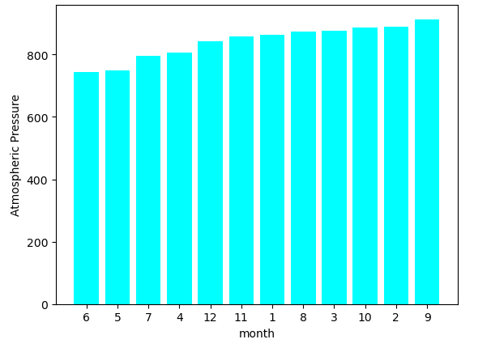
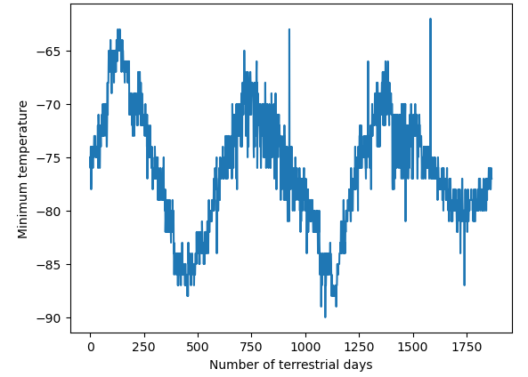

# Mission to Mars
The aim of this study is to scrape data from the NASA website to study the planet Mars Weather and News. For this purpose, a python code is written to extract the data from the html file of the website.

## Overview of the analysis
The first part of this study is dedicated to data scraping from NASA's website to find the planet Mars recent news. The website address is https://redplanetscience.com. Our code use automated browsing to visit and look for the titles and preview of the information in the HTML file of the website. These results are then exported to a MongoDb database and is saved as a Json file for further studies.

The next part of this study is extracting wheather data from https://data-class-mars-challenge.s3.amazonaws.com/Mars/index.html. Similarly, automated browsing is used to access the website and scrape the data from the table that is provided in the website.

The next part of the study is examining the data, transforming it to usable data and extracting the needed information from the data. The extracted and cleaned data is stored in a datafram for further analysis.

Here are the information that each column presents: 
  - id: the identification number of a single transmission from the Curiosity rover
  - terrestrial_date: the date on Earth
  - sol: the number of elapsed sols (Martian days) since Curiosity landed on Mars
  - ls: the solar longitude
  - month: the Martian month
  - min_temp: the minimum temperature, in Celsius, of a single Martian day (sol)
  - pressure: The atmospheric pressure at Curiosity's location

## Results
On average, the third month has the coldest minimum temperature on Mars, and the eighth month is the warmest. But it is always very cold there in human terms!

Atmospheric pressure is, on average, lowest in the sixth month and highest in the ninth.

The distance from peak to peak is roughly 1425-750, or 675 days. A year on Mars appears to be about 675 days from the plot. Internet search confirms that a Mars year is equivalent to 687 earth days.

